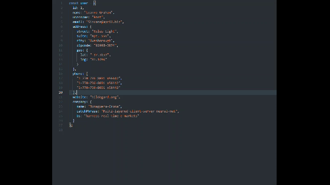

# Interface builder

## Note
This extension defines interface of object

## Usages
* Select the object with any selection tool
* Use shortcut `ctrl+alt+i` (`command+alt+i` for Mac), or press `F1` and then select/type `Insert interface`
* Use shortcut `ctrl+alt+o` (`command+alt+o` for Mac), or press `F1` and then select/type `Replace by interface`
* Use shortcut `ctrl+alt+u` (`command+alt+u` for Mac), or press `F1` and then select/type `Export interface`

## Configuration
* **interface-builder.defaultInterfaceName**: Install default interface name. Used when insert and replace and when exporting with blank interface name. Follow the TS syntax rules.
* **interface-builder.postfix**: Used for exporting file name. Example: user.type.ts

